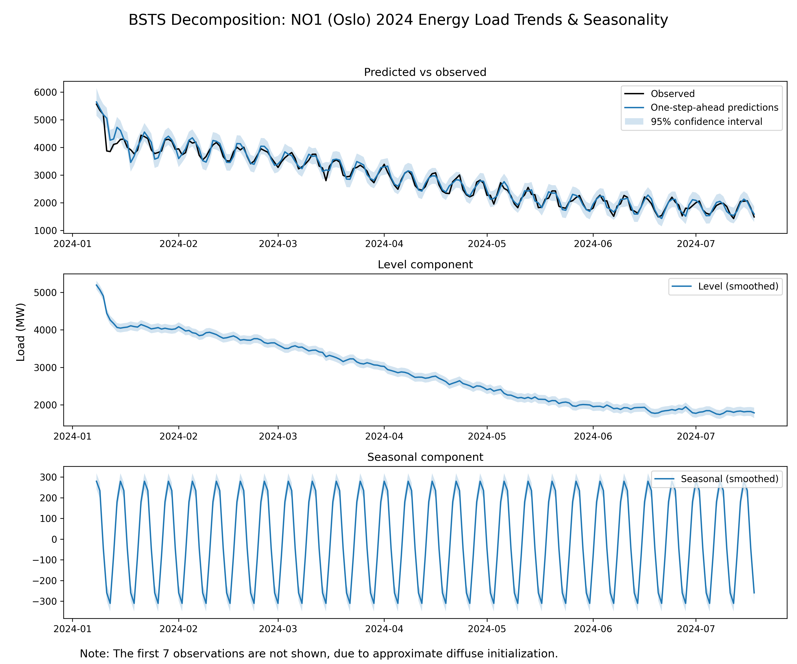
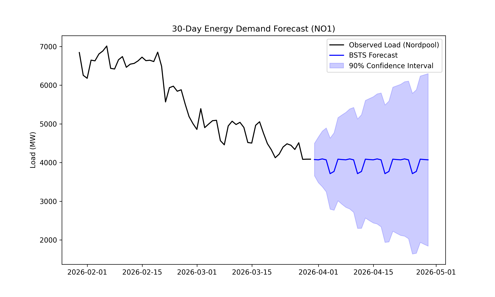

# Energy Uncertainty BSTS

[](https://github.com/aarain/Energy-Uncertainty-BSTS/actions/workflows/update_data.yaml)

This project uses **Structural Time Series (STS)** to break down energy load into clear trend patterns while
accounting for external market shocks. Unlike traditional point-estimate models, this approach uses a
**probabilistic forecast** to quantify worst-case scenarios. It is specifically designed to handle volatile global
energy markets, providing a more reliable edge for short-term trading decisions.

## 📈 Model Output

Historic trend decomposition - _Isolates the underlying growth trend from seasonality and irregular market volatility:_


Point estimate and confidence intervals - _Quantifies 90% confidence intervals_ (P10/P90) to inform Value-at-Risk (VaR):


## 📊 Statistical Profile

The model is built on a **Linear Gaussian State Space** framework. Energy markets often exhibit non-linear behaviour,
but using this structural approach provides a reliable baseline by decomposing the signal as follows:

* **Distribution**: A Gaussian (Normal) error structure is assumed for the stochastic components.
This allows generation of the symmetric 90% predictive intervals seen in the forecast.

* **Components**:
  * **Local Level**: A random walk process that captures the shifting baseline of energy demand.
  * **Seasonality**: A seasonal component that models the 7-day weekly cycle of human and industrial activity.

* **Estimation**: This model uses the Kalman Filter and Maximum Likelihood Estimation (MLE) within a state space
framework to separate the trend and seasonality components from observed noise.

## 🛠 Installation

All the commands in this README assume use of a Linux terminal.

How to get the development env running:

1. **Clone the repo**, e.g. by using the GitHub CLI: `gh repo clone aarain/Energy-Uncertainty-BSTS`
2. **Set up the virtual environment**:
    ```bash
   python3 -m venv .venv --system-site-packages
   source .venv/bin/activate
   pip install -r requirements.txt
    ```

### Development Workflow
This project uses `pip-tools` to manage dependencies. To update the lockfile:
1. Ensure your environment has `pip-tools` installed.
2. Run `pip-compile requirements.in` to generate a fresh `requirements.txt`.
3. Run `pip-sync` to align your virtual environment.

**Note**: This project requires `scipy < 1.13.0` to maintain compatibility with the `statsmodels` state-space backend
in Python 3.12.

## ▶️ Usage

**Generate Plots**: `python src/energy_uncertainty_bsts/generate_plots.py`

**Run Linter**: `ruff check .`

**Run Tests**: `pytest`

## 🔑 API secrets

To fetch the ENTSO-E energy load data, the data fetcher script requires an API key.
This API key (named `ENTSOE_API_KEY`) has been encrypted using `dotenvx` and stored in the `.env` file.
The GitHub secrets manager also stores this API key as well as the associated `DOTENV_PRIVATE_KEY` requred to decrypt
it, and injects the API key into the runtime environment.
The data fetcher automation is configured in this project's GitHub workflow yaml file.

To run the data fetcher manually, use the following command:

`PYTHONPATH=. npx dotenvx run -- python src/energy_uncertainty_bsts/data_fetcher.py`

## 🚀 Roadmap

### Current implementation

The following phase is active:

#### Phase 1: Probabilistic Baseline

The current version of this project provides a functional probabilistic baseline for energy load. This implementation:

* Utilises Structural Time Series (STS) to isolate the local Level (long-term trend) from yearly and weekly
seasonality.
* Moves beyond single-point estimates by generating 90% confidence intervals, providing a mathematical basis for
Value-at-Risk (VaR) analysis.
* Models asymmetric tail risk to identify supply-side shortages and demand-side surges.
* Uses a high-variance synthetic data engine to simulate Nordic energy load spikes (caused by events such as a winter
cold snap).

### Future development

To move towards a production-ready trading tool, the following phases are planned:

#### Phase 2: Real-world data & sanitisation

* Replace synthetic data generation with real historical CSV datasets:
   * This should add realistic external regressors such as weather (temperature and wind speed), storage (reservoir
water levels), residential EV usage (creating a peak in mornings and evenings), and price coupling (Norwegian exports).
   * [_Implemented_] Source data from either the ENTSO-E Transparency Platform or Nord Pool day-ahead for NO1 price area (open data).
* Sanitise the (real-world) input data:
   * [_Implemented_] Handle sensor gaps using forward-filling/linear interpolation.
   * [_Implemented_] Detect and remove outliers caused by non-market events (e.g. sensor malfunctions or manual grid overrides) while
preserving extreme weather events.

#### Phase 3: Model validation

* Validate the sanitised data:
   * Recursively back-test historical data by implementing a time series split using a rolling window to measure the
data's MASE (Mean Absolute Scaled Error).
   * Verify the model's calibration using a PIT (Probability Integral Transform) histogram. A U-shaped histogram
implies underconfidence (narrow intervals), while an inverted U shape implies overconfidence (wide intervals).

#### Phase 4: Machine learning operations & interactive visualisation

* Use GitHub Actions to automate the process of retraining the model on new seasonal data.
* Build an interactive dashboard (e.g. with Streamlit). This should allow the user to:
   * Recalculate the BSTS forecast in real time based on certain parameters e.g. wind speed.
   * Toggle between different VaR levels i.e. 90%, 95%, 99%.
   * Compare the sanitised input data with their model's calibrated forecast.

#### Phase 5: Transition to full Bayesian inference

* Transition from using MLE to Bayesian MCMC (Markov Chain Monte Carlo) to simulate the posterior distribution of the
underlying states, i.e. migrate from using `statsmodels` to one of `PyMC`, `TensorFlow Probability`, `PyBSTS`.
* Use the full posterior distribution to refine VaR calculations.
* Implement priors to automatically identify which external regressors have the most predictive power
e.g. reservoir levels, wind speed.

**Note:** The transition from MLE to BSTS will increase the computational complexity and thus the runtime from under
1 second to 1-5 minutes.
